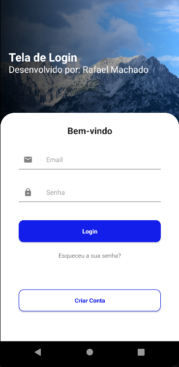

# Tela de LoginUI

## Descrição do Projeto

Este projeto Android desenvolvido em Kotlin oferece uma experiência de usuário simplificada e eficiente, focada em autenticação. A interface de usuário apresenta um design intuitivo e amigável, com um botão de login e um botão de criar conta. Os usuários têm a flexibilidade de escolher entre realizar login com suas credenciais existentes ou se cadastrar para criar uma nova conta.

## 📸 Captura de tela

    

